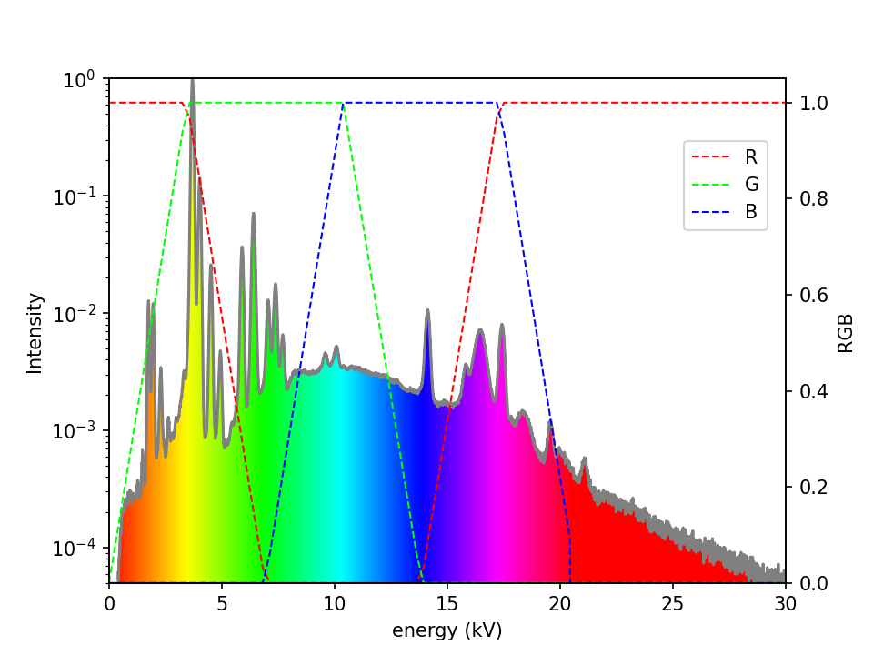
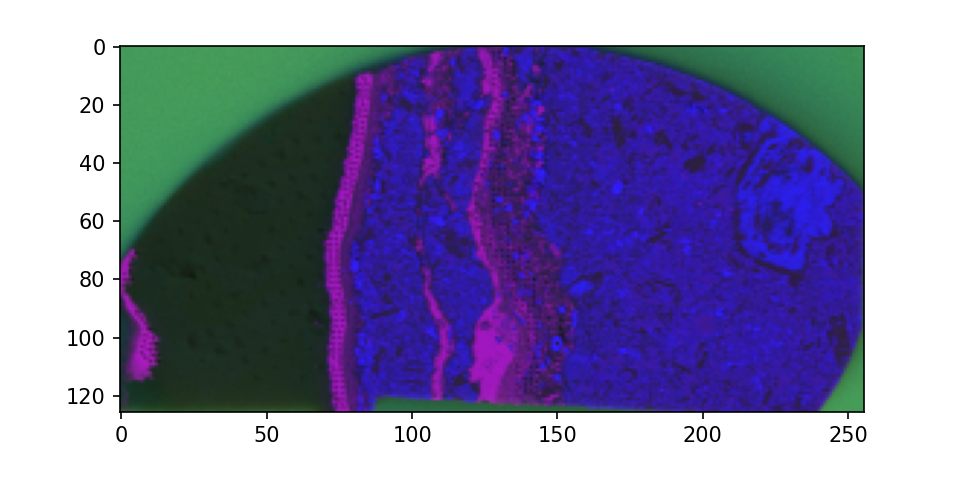

# Overview

This tool parses spectrum-by-pixel maps from X-ray Flourescence Microscopy (XFM). It is currently compatible with ATLAS-series spectrometers from IXRF Inc. 

These instruments raster a high-energy X-ray beam across a specimen, detecting X-ray fluorescence from the material. The resulting dataset is a spectral cube containing an elemental fingerprint across the map. This data can be used to determine the composition of the material at each pixel. 

Analysis is manual and time-consuming, and there is a need for rapid, automated visualisation and class-averaging to inform the user's decision-making during the experiment.

This package performs dimensionality-reduction and clustering on XFM datasets, producing class-averages which aid in manual processing. It also produces a simple RGB visualisation weighted by spectral region, as an at-a-glance representation of these multidimensional datasets. 

# Summary:

- parses JSON/binary .GeoPIXE files via Xfmap class

- extracts pixel records and pixel parameters into PixelSeries class

- projects spectra onto an RGB colourmap for rapid visualisation of the distribution of major phases

- performs dimensionality-reduction

- performs class-averaging, and exports these class averages for use in later processing

# Method

The instrument data format is a mixed JSON/binary with sparse pixel records:

  
   

- Config files and optional arguments are read and initialised
    - (utils.readargs and utils.initcfg)
- The file and spectrum objects are initialised for parsing
    - (obj.Xfmap, obj.PixelSeries)
- The binary file is loaded in a series of chunks 
    - (parser.getstream and obj.Xfmap.nextchunk)
- The JSON header is loaded as a dictionary, yielding map dimensions and other parameters
    - parser.readfileheader
- Pixel records are parsed and loaded into a large 2D numpy array (shape = pixels * channels) 
    - (Xfmap.parse via parser.readpxdata)
    - Pixel parameters are extracted from the indidual pixel headers
        - parser.readpxheader
    - Any missing channel records are reintroduced as zeroes
        - (utils.gapfill)
- If needed, a submap is extracted progressively with the necessary header updates throughtout
    - (parser.writepxheader and parser.writepxrecord)
- The fully extracted data is stored in a PixelSeries object for analysis

Single-pixel spectra are mapped to RGB values using the HSV colourmap:
- Sum of: spectrum intensity * R G B channel values, across spectrum
    - (colour.spectorgb)

  
   

- An x * y map is created from RGB-values per pixel:
    - (colour.complete) 

  
   

#

Pixels are categorised, class-averaged and mapped:
- Perform dimensionality reduction via both PCA and UMAP
    - (clustering.reduce)
- Categorise via K-means
    - (clustering.dokmeans)
- Class averages generated and stored
    - (clustering.complete)
- Category maps displayed for each reducer
    - (clustering.clustplt)

  
   

# Usage

The package is executed via core.py

Run parameters and desired behaviour are controlled by two config files:
- User-modifiable flags (eg. input file, output dimensions) are stored in config.yaml
    - these flags can also be passed in as command line arguments
- Development flags and tuning parameters are read from xfmreadout/protocol.yaml

An example dataset is provided in ./data/geo1.GeoPIXE
