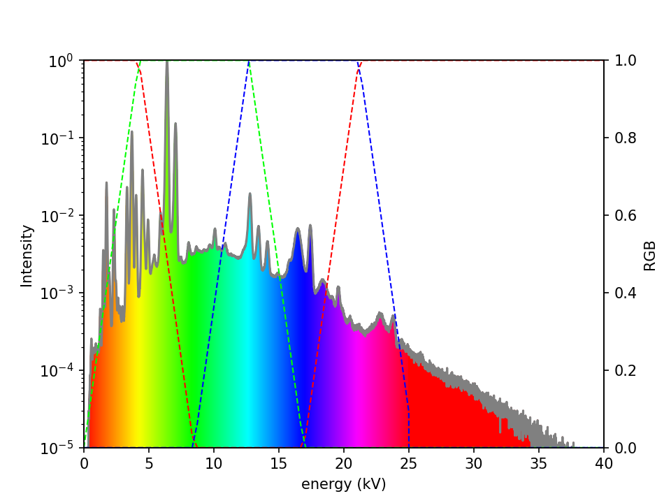
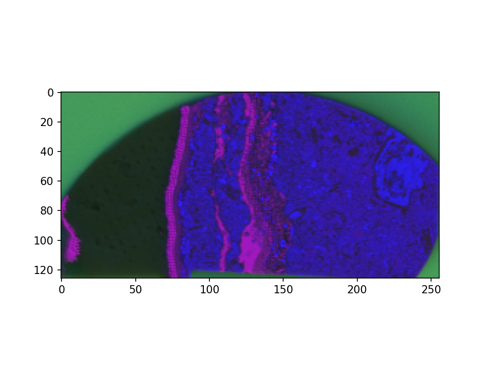
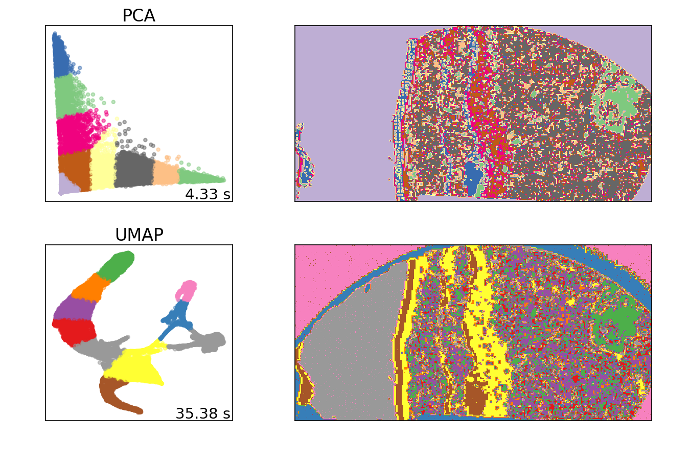

# Overview

This is a tool to parse spectrum-by-pixel maps from X-ray Flourescence Microscopy (XFM). It is currently compatible with ATLAS-series spectrometers from IXRF Inc. 

These instruments raster a high-energy X-ray beam across a specimen, detecting X-ray fluorescence from the material. The resulting data is a spectral cube containing an elemental fingerprint across the map. This data can be used to determine the composition of the material at each pixel. 

Analysis is manual and time-consuming, and there is a need for rapid, automated visualisation and class-averaging to inform the user's decision-making during the experiment.

This package performs dimensionality-reduction and clustering on XFM datasets, producing class-averages which aid further manual processing. It also produces a simple RGB visualisation weighted by spectral region, as at-a-glance representations of these multidimensional datasets. 

# Summary:

- parses JSON/hexadecimal .GeoPIXE files

- extracts pixel records and pixel parameters

- projects spectra onto an RGB colourmap as a rapid visualisation of the major phases

- performs dimensionality-reduction

- performs class-averaging, and exports these class averages for use in later processing

# Method

The instrument data format is a complex mixed JSON/hexadecimal:

  
   

- JSON header is loaded as a dictionary, yielding map dimensions
    - (src.bitops.readgpxheader)
- Pixel records are loaded into large 2D numpy array (shape = pixels * channels) 
    - (src.bitops.readpxrecord) 
- Skipped channel records are reintroduced as zeroes
    - (src.utils.gapfill)

Single-pixel spectra are mapped to RGB values using the HSV colourmap:
- Sum of: spectrum intensity * R G B channel values, across spectrum
    - (src.colour.spectorgb)

  
   

- Create x * y map from RGB-values per pixel:
    - (src.colour.complete) 

  
   

Pixels are categorised, class-averaged and mapped:
- Perform dimensionality reduction via both PCA and UMAP
    - (src.clustering.reduce)
- Categorise via K-means
    - (src.clustering.dokmeans)
- Class averages generated and stored
    - (src.clustering.complete)
- Category maps displayed for each reducer
    - (src.clustering.clustplt)

  
   

# Usage

The tool is run as a script from core.py, or Jupyter notebook explore.ipynb

An example dataset is provided in ./data

The path to the dataset to be analysed is set in config.py, together with various flags and control parameters. 
